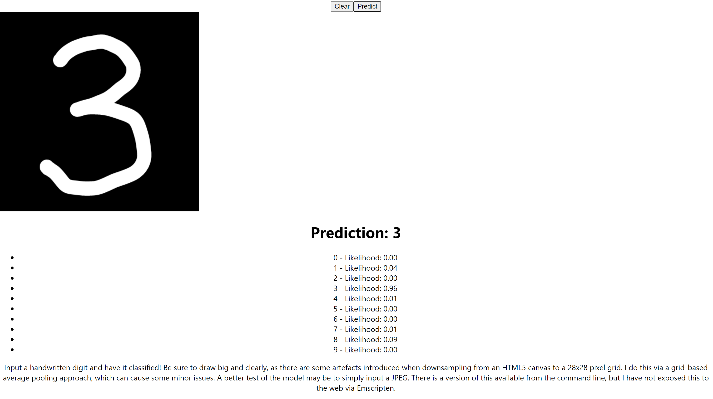

# Machine Learning in C++

This was a personal project to implement neural networks from scratch in C++. I was able to make the following 
1. fully connected layers 
2. convolution layers
3. pooling layers (max and average pooling)
4. activation function layers

This is enough to create a minimum viable convolutional neural net for computer vision. This is demonstrated by training on the MNIST handwritten digits dataset and achieving 97% accuracy on test data. Of course, we may use this for other tasks than handwriting recognition. However, digits provide a computationally simple demo that may easily be ported to the web.

I incorporate the digit-recognition model into a React app via WebAssembly (detailed [below](#frontend)). 

# Frontend

We make use of a [canvas drawing React component](https://www.npmjs.com/package/react-canvas-draw) to allow users to input a handwritten digit. We then take the pixel data from this image, pass it through the model via WebAssembly, then return a prediction. 

I have implemented no CSS for this, so the style is pretty barebones. Further, I have not yet deployed this to anywhere on the web, so we may run it by cloning the repo and executing the following:

```
cd frontend
yarn start
```

Here is what it should look like: 

# Some Things I Would Change Given Enough Time
1. CUDA support for performance. CUDA does not play nicely with the STL or object-oriented design patterns, so including CUDA support would take a massive overhaul that I don't have the budget for timewise. 

2. Padding in the convolutional layers was never fully implemented. This was not much of a hindrance since my laptop couldn't handle large amounts of data or complicated network architectures.

3. Do proper serialization via something like Boost. To avoid the library dependencies, which are difficult when compiling via `emcc`, I homebaked model serialization into `.txt`'s. Storing with strings is clearly not an efficient use of storage, but is fine at the current scale.

4. More universal preprocessor guards. In particular, to better handle the use of `g++` vs `emcc`.

5. Find a good way to store training data. I didn't want to abuse git by pushing tens of thousands of training images, so I only stored them locally. Same thing with compiled binaries.

6. Write a good testing suite.

7. CSS. The style on the fronted is nonexistent.

8. Better resizing of the image from an HTML5 canvas. On the frontend, when inputting the image I resize via average-pooling to a 28x28 sized image. However, this can cause some strange behavior. A better approach would to use existing image-resizing approaches, however this introduced more dependencies and the pooling method only causes minimal problems. Further, a more general approach would allow the canvas size to be changed in the UI without inducing any issues, but as it stands now the size is carefully constructed to play well with average pooling.

9. Data Augmentation. Further performance on the MNIST data, as well as many computer vision tasks, can be achieved through data augmentation. A primary way of achieving this is by affinely transforming the data appropriately. That is, we may slightly scale, rotate, and translate the data and treat these transformed copies as new training data. This gives the model some level of affine-invariance. 

## Emscripten

Note that the target `predictor` is compiled with `emcc` rather than `g++`. Moreover, it is the only target meant to be used in this way.

This could've been accomplished with `emmake`, but that was throwing some weird errors and this worked for whatever reason.

Note that the usual JavaScript outputted by `emcc` does not play well with React, so we augment it by following [this](https://stackoverflow.com/questions/60363032/proper-way-to-load-wasm-module-in-react-for-big-files-more-than-4kb). We then move `predictor.js` to `frontend/src` and `predictor.wasm` to `frontend/public`. 

## Plots

Some of the plots found in `plots/` are not up to date. Some better pictures representing training may be found in older commits.


